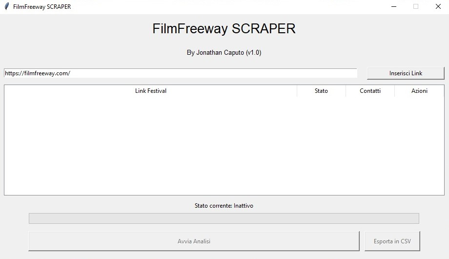

# FilmFreewayScraper
Scrape author from filmfreeway

## Obiettivo
L'obiettivo di questo script è automatizzare la raccolta delle email e informazioni delle persone interessate a determinati festival di FilmFreeway.
Per persone interessate si intendono le persone che hanno lasciato una recensione sul festival analizzato.

## Installazione
1. Scaricare [Tampermonkey](https://www.tampermonkey.net/)
2. Scaricare [script.js](https://github.com/Jonnycp/filmfreewayScraper/releases/download/v1/script.js)
3. Importalo in Tampermonkey
4. Divertiti

## Uso
1. Vai sulla pagina di un festival (https://filmfreeway.com)
2. Se ci sono recensioni comparirà il pulsante "Scarica autori" vicino ad esse
3. Cliccando procederà al download dei dati in formato csv.

## Story
### ALPHA (Python)
È stata realizzata prima una versione alpha in python (`webscraper.py`) che attraverso l'uso della libreria `requests` effettuava una serie di richieste per:
- ricavare l'id del festival
- ottenere le recensioni per ogni "pagina" (max 5 per pagina)
- ricavare le persone "cliccabili"
- ottenere i dati degli artisti trovati
- creare il file csv associato

Ha funzionato per un po', ma aveva dei problemi perchè dopo un tot di richieste veniva bloccato completamente il programma.
Il sito non rispondeva con la pagina, ma con una pagina intermedia di redirect.

### BETA (Interfaccia in Python)
Si è pensato di aggiornare la versione alpha creando una versione con interfaccia (sviluppata in `tkinter`): `newScraper.py`.
L'interfaccia ha un campo di testo e una tabella in cui aggiungere tutti i link dei festival da analizzare e un pulsante per avviare l'analisi e poi scaricare i dati.
C'erano possibiltà di aggiornamenti con funzionalità come l'editing di csv esportati dal programma, la modifica di alcuni dati degli autori e altro.
Il codice è stato strutturato a classi, implementando l'interfaccia e una classe che attraverso i thread avrebbe dovuto effettuare lo scrape `Scraper.py`

Utilizzando librerie che implementavano un vero e proprio browser (`pyppeteer` e `selenium`) invece di effettuare richieste curl, funzionava, ma a un certo punto interveniva Cloudfare con la verifica captcha. Anche se si rallentavamo le richieste.
Il ciò ha portato all'abbandono del linguaggio python.

### VERSIONE 1.0
Si è pensato che se ad effetturare le richieste sarebbe stato il sito stesso, non si sarebbe mai bloccato... e così è stato.
È stato realizzato uno script javascript (`script.js`) da iniettare nel sito con Tampermonkey.
Implementa un pulsante "Scarica autori" che avvia lo scrape e il download del csv associato seguendo i passaggi della versione alpha.

Questa versione funziona.

## CSV
Il file di output è formato dalle seguenti colonne:
- nome
- cognome
- email
- città
- titolo
- biografia
- data di nascita
- link autore
- link festival

## TODO
[] Scrape multi festival
[] Aggiungere pulsante download recensioni fuori dalla pagina del festival
[] Migliorare divisione nome/cognome
[] Pulire codice

## Contatti
Sviluppato da jonathan-caputo@hotmail.com
